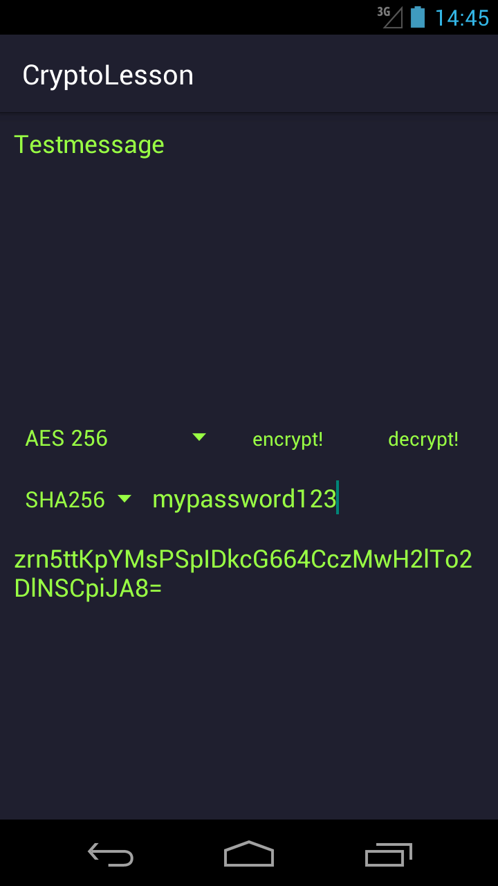

# CryptographyLesson

## Introduction
This android app shows how cryptographic algorithm works. You can encrypt or decrypt messages and try different algorithms. 
Powered by <i>Bouncy Castle</i> this app supports AES, Serpent, Blowfish and many more :)

## Screenshots

## Disclaimer
This app is only intended for education and not to replace any security solution.

## External resources
<a href="https://www.bouncycastle.org">Bouncy Castle</a>
